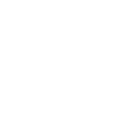
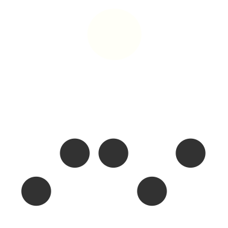
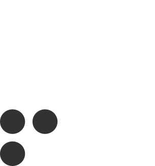
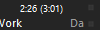

# foobar2000 TripleQ theme

A minimalist yet versatile foobar2000 skin with 3 (switchable) view-modes  
and several nice gadgets like:

&nbsp;&nbsp;&nbsp;&nbsp;
&nbsp;&nbsp;◆&nbsp;&nbsp; a **playlist-view** with an integrated **playlist-manager**  

&nbsp;&nbsp;&nbsp;&nbsp;

&nbsp;
a lightweight **filesystem browser**  with quick-access to selected folders   
&nbsp;&nbsp;&nbsp;&nbsp;&nbsp;&nbsp;&nbsp;&nbsp;&nbsp;&nbsp;&nbsp;&nbsp;
... and the capability to sort files _"in alphabetic order"_ or by _"last modified date"_

&nbsp;&nbsp;&nbsp;&nbsp;

&nbsp;
**library- and**
 
**coverflow views**  
&nbsp;&nbsp;&nbsp;&nbsp;&nbsp;&nbsp;&nbsp;&nbsp;&nbsp;&nbsp;&nbsp;&nbsp;
... to get a nice overview of your well sorted collection
  
&nbsp;&nbsp;&nbsp;&nbsp;

&nbsp;
a **tree view** to search and filter everything in your media-library  
&nbsp;&nbsp;&nbsp;&nbsp;&nbsp;&nbsp;&nbsp;&nbsp;&nbsp;&nbsp;&nbsp;&nbsp;&nbsp;
(including the stuff in messy unsorted folders)

&nbsp;&nbsp;&nbsp;&nbsp;
 
&nbsp;
a **queue content editor** to keep track of what's going to play next

... and some equally nice utility-buttons that help with recurring tasks like

&nbsp;&nbsp;&nbsp;&nbsp;


&nbsp;
 quickly move & rename files and folders to a pre-defined structure  
&nbsp;&nbsp;&nbsp;&nbsp;

&nbsp;
apply replay-gain (
and notice if replay-gain is missing)  
&nbsp;&nbsp;&nbsp;&nbsp;

&nbsp;
set the output-device  
&nbsp;&nbsp;&nbsp;&nbsp;

&nbsp;
open containing folder  
&nbsp;&nbsp;&nbsp;&nbsp;

 


change playback order  

---------




# Installation (quick and easy)
✔ checked with foobar2000 **(v1.6.7)**

## 🏕 Portable:

1) Install [Foobar2000](https://www.foobar2000.org/) (portable) **(don't start it yet!)**
2) Copy all files into the installation folder (replace existing files)
3) Start foobar2000, open preferences (`crtl + p`) and set your music-directory in the *"Media Library"* tab
4) Enjoy!

## 🏡 Standalone:

1) Install [Foobar2000](https://www.foobar2000.org/) (standard)  
2) Copy all files into your foobar2000 `configuration`-folder (replace existing files)
   - it is located at `"%appdata%\foobar2000"` 
     (if it does not yet exist, start *foobar2000* and close it again)
3) Start foobar2000, open preferences (`crtl + p`) and set your music-directory in the *"Media Library"* tab
4) Enjoy!

## 🌌  if you know how to deal with **git**

1. Install [Foobar2000](https://www.foobar2000.org/) (standard) 
2. navigate to the `configuration`-folder and execute the following commands:
   (warning, files already present in the folder will be overwritten!!)

```
git init
git remote add origin https://github.com/raphaelquast/foobar2000_TripleQ.git
git fetch
git checkout -t origin/master -f
```

3. Enjoy!

# General Infos

## Hotkeys

#### 🌍 GLOBAL

The theme incorporates the following **global hotkeys** (e.g. also working if the player is not in focus):  
(they might interfere with other apps using similar assignments... however I've never had problems so far)


| | | |
| --- | --- | --- |
|`crtl + shift + space` | activate/deactivate the player window (e.g. show/hide) | |
|`crtl + shift + enter` |  play / pause | |
|`crtl + shift + up   ` | previous track | |
|`crtl + shift + down ` | next track | |
|`crtl + shift + left ` | move 5 seconds ahead in the current track | |
|`crtl + shift + right` | move 5 seconds back in the current track | |

#### ◯ If the player is focused
| | | |
| --- | --- | --- |
|`alt + a` |  toggle *"always on top"* | |

#### ▷ If the playlist is focused
| | | |
| --- | --- | --- |
|`tab` | show / hide playlist manager | |
|`crtl + t` |show / hide title bar | |
|`crtl + i` | show / hide playlist header | |
|`crtl + q` | add selected tracks to playback queue | |
|`crtl + w` | remove selected tracks from playback queue | |

## Folder structure

The theme is intended to be used with a well sorted collection...  
... you'll get the best out of the TripleQ theme if your music is structured in the following form:  
(note the () and () buttons that help with that task!)

To allow having both sorted and unsorted stuff in your music folders,  
❗ **any folder that starts with 2 underscores will remain hidden in the *Library-* and *Coverflow* views!**   
(It'll still be visible in the *Tree view* and *File Browser* tabs)

```
- Musik   (the base-directory of your "Media Library")
└─── __unsorted_folder (note the DOUBLE underline!)
│   └─── ... (all the unsorted stuff)
│
│   Artist_1
│   └─── Album Title 1 [Date]
│   │    │   01 - Track Title 01.mp3
│   │    │   02 - Track Title 02.mp3 
│   │    │   ...
│   │    │   Cover.jpg (possible names and formats specified in "Preferences/Display/Album art")
│   └─── Album Title 2 [Date]
│   Artist_2
│   └─── ...
│    ...
│
│   _Compilations (note the single underline in the beginning)
│   └─── Compilation Title [Date]
│   │    │   01 - Artist 01 - Title 01.mp3
│   │    │   02 - Artist 02 - Title 02.mp3
│   │    │   ...
│   │    │   Cover.jpg 
```

## ❗ Notice

- To make the buttons `Move to sorted music` () and `Move to unsorted music` () work, the directories must be adjusted. 
   1. select an arbitrary song in the playlist 
   2. click on () or ()
   3. go to `More options` (located at the bottom left of the popup-window) and change the "Destination Folder" for both presets 
      - here you can also set your own file-naming convention if you're not happy with the default 
   4. don't forget to hit `save` once you're done!
   one!
## Thanks to

all the developers that created the awesome components that TripleQ is based on:

- [Columns UI](https://github.com/reupen/columns_ui)
- [Spider Monkey Panel](https://theqwertiest.github.io/foo_spider_monkey_panel/)
- [Panel Stack Splitter](http://foo2k.chottu.net/)
- [Waveform Minibar (Mod)](http://www.foobar2000.org/components/view/foo_wave_minibar_mod)
- [EsPlaylist](http://foo2k.chottu.net/)
- [Queue Contents Editor](https://www.foobar2000.org/components/view/foo_queuecontents)
- [UI Hacks](http://foobar2000.ru/forum/viewtopic.php?t=1911)
- [Playback Statistics](https://www.foobar2000.org/components/view/foo_playcount)
- [Coverflow](https://github.com/Chronial/foo_chronflow)
- [Eole theme (thx for some ideas on .js routines)](https://github.com/Ottodix/Eole-foobar-theme)
- [br3tt for his WSH Tree Explorer script](https://www.deviantart.com/br3tt/art/WSH-Tree-Explorer-1-7-196023730)
